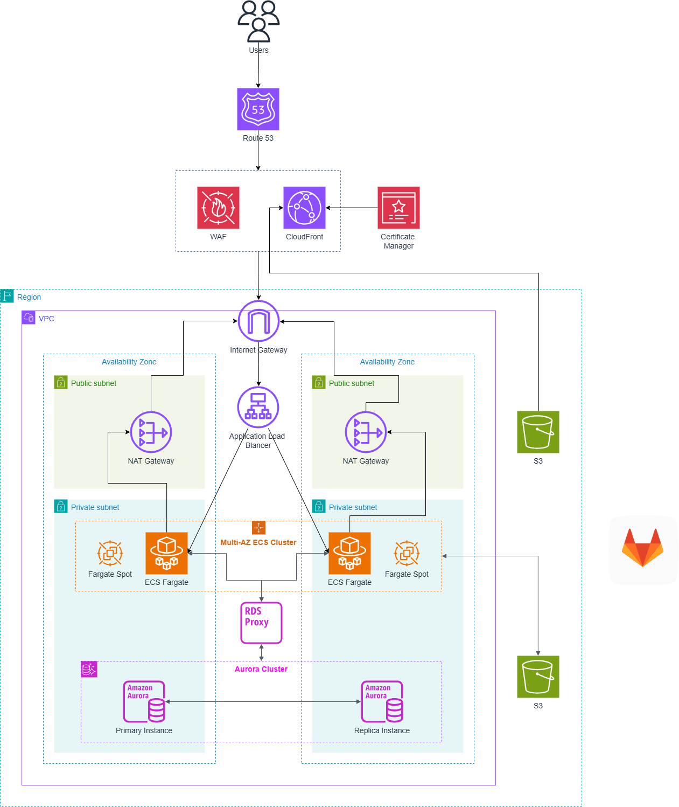

# Locket Clone — AWS Infrastructure (Terraform)



Terraform for the architecture diagram:

```
Users → Route 53 → WAF + CloudFront (ACM)
                      ├── /            → S3 (frontend static build, via OAC)
                      └── /api/*       → ALB (public subnets)
                                          → ECS Fargate + Fargate Spot (private subnets, 2 AZ)
                                              → RDS Proxy → Aurora PostgreSQL (writer + replica)
                                              → S3 (moments bucket)
```

- VPC 2 AZ: public subnets (ALB, NAT Gateway per AZ) + private subnets (ECS, RDS).
- ALB only accepts traffic from CloudFront (origin-facing prefix list).
- DB credentials in Secrets Manager, injected into the task; app talks to RDS Proxy.
- Backend uses the task IAM role for S3 (no access keys).
- GitLab CI (in the diagram) builds & pushes `backend_image`; not managed here.

## Prerequisites

- Terraform ≥ 1.6, AWS CLI with credentials configured
- Backend image pushed to a registry (default: `n3thanh/locket-app:latest`)
- Backend must expose `/actuator/health` (ALB health check) — actuator is in `pom.xml`
- Optional: a Route 53 hosted zone if you set `domain_name`

## Deploy

```bash
cd devops/terraform
cp terraform.tfvars.example terraform.tfvars   # edit as needed

terraform init
terraform plan
terraform apply
```

First apply takes ~20–30 minutes (Aurora + RDS Proxy + CloudFront are slow).

## Deploy the frontend

The SPA is served from S3 via CloudFront (nginx is not used on AWS — CloudFront
does the `/api/*` routing instead):

```bash
cd frontend
npm ci && npm run build

aws s3 sync dist "s3://$(terraform -chdir=../devops/terraform output -raw frontend_bucket)" --delete
aws cloudfront create-invalidation \
  --distribution-id "$(terraform -chdir=../devops/terraform output -raw cloudfront_distribution_id)" \
  --paths "/*"
```

Open the URL from `terraform output app_url`.

## Update the backend

Push a new image tag, then force a new deployment:

```bash
aws ecs update-service \
  --cluster "$(terraform output -raw ecs_cluster_name)" \
  --service locket-backend \
  --force-new-deployment
```

## Costs / dev-mode notes

This is sized for dev/demo but still bills real money — the always-on pieces
(2× NAT Gateway, 2× Aurora `db.t4g.medium`, RDS Proxy, ALB, Fargate) are roughly
$250–300/month. Tear down with `terraform destroy` when not in use.

Dev-friendly settings you should tighten for production:
`skip_final_snapshot`, `deletion_protection = false`, `force_destroy` on buckets,
`recovery_window_in_days = 0` on the secret, 1-day DB backups.
